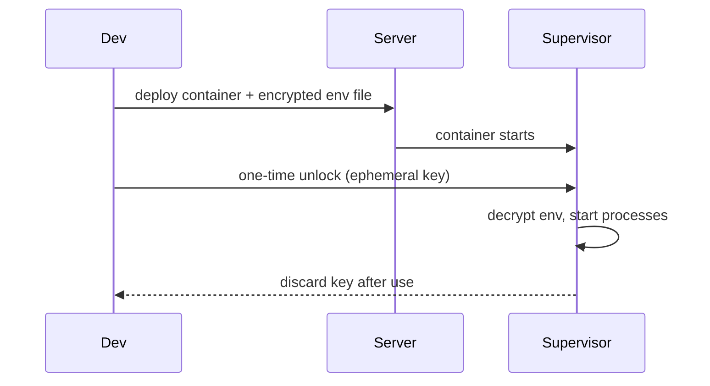

# Encrypted Environment Variables

Env vars are currently stored as plaintext in `/var/lib/tillandsia/<app>/env` on the server. This means anyone with SSH access to the server can read all secrets (DB passwords, API keys, etc.).

**Concept:** Encrypt the env file on disk and have the supervisor decrypt it at startup using a key that never touches the server filesystem.

Key questions to resolve:
- How does the supervisor receive the decryption key? SSH session stdin? Management API call from the CLI after deploy?
- What identity proves "this is the authorized developer"? App identity cert (future) or just possession of the deploy SSH key?
- Where does the key live? On the dev machine at `~/.config/tillandsia/keys/<app>/`?
- Should the env file be encrypted locally before transfer, or re-encrypted on the server?
- Does a container restart (e.g. from `tillandsia env set`) require re-unlocking, or does the supervisor keep the key in memory?

Not urgent — MVP can ship with plaintext env vars behind a documented caveat.